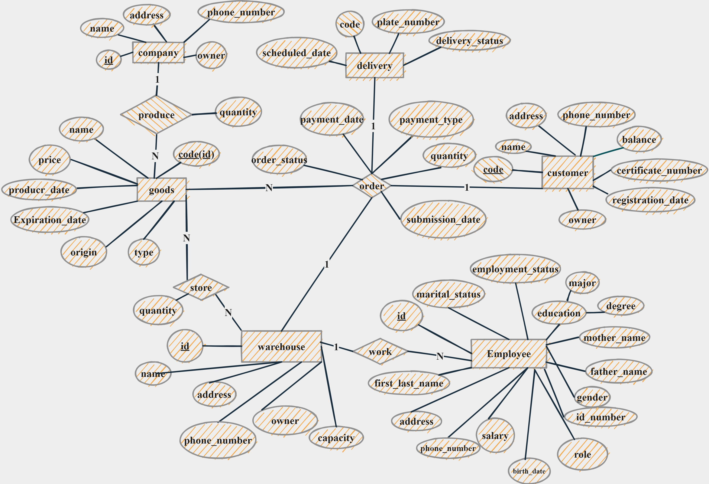
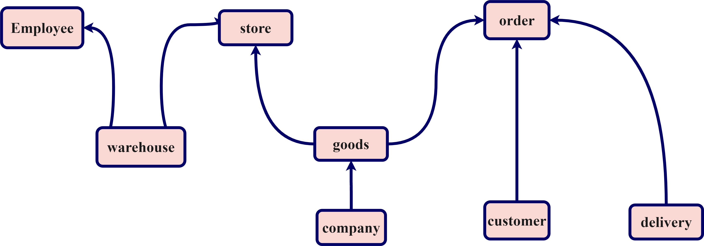

# Icarus - Warehouse Management System for medicine
In this project, with PostgreSQL and Flask, we tried to design a web application to ease the management of warehouses.  
***
The final report is available at: https://github.com/ghazaleh-mahmoodi/Icarus/blob/main/FinalPhase_Report.pdf

### Entity-Relationship Diagram

### Reference Graph
Illustrates how each entity refrences to the source entity

